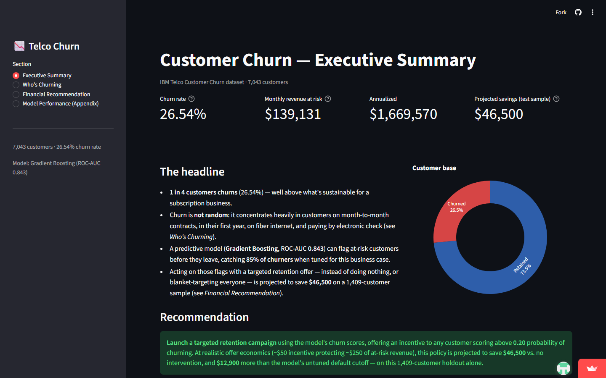

# Telco Customer Churn — Analysis & Retention Recommendation

Analysis of IBM's Telco Customer Churn dataset (7,043 customers): data cleaning, churn driver analysis,
a predictive model, and a cost-optimized retention targeting strategy — plus an executive dashboard for
presenting the findings.

**Live dashboard:** https://telco-churn-executive-dashboard.streamlit.app



## Contents

- **`WA_Fn-UseC_-Telco-Customer-Churn.csv`** — raw dataset.
- **`telco_churn_analysis.ipynb`** — full technical workflow: cleaning, EDA, model comparison (Logistic
  Regression, Random Forest, Gradient Boosting, XGBoost), threshold tuning, cost-based decision optimization,
  and calibration checks.
- **`dashboard/`** — a Streamlit executive dashboard summarizing the findings for a non-technical audience.
  - `app.py` — the dashboard.
  - `prepare_data.py` — precomputes the model and cost-analysis artifacts the dashboard reads.
  - `artifacts/` — precomputed CSV/JSON outputs (churn drivers, thresholds, cost policy comparison, etc.).
- **`telco_churn.pbix`** — a Power BI dashboard covering the same four areas as the Streamlit app (executive
  summary, churn drivers, financial recommendation, model performance). The semantic model — tables, DAX
  measures — was built by connecting directly to a live Power BI Desktop session, then the report visuals
  were placed on the canvas manually. Open it in Power BI Desktop to explore.

## Headline findings

- **26.5% churn rate** overall, concentrated in month-to-month contracts, customers in their first year,
  fiber-optic internet subscribers, and electronic-check payers.
- A Gradient Boosting model (ROC-AUC 0.843) predicts churn well ahead of time.
- Framing retention offers as a cost/benefit decision (offer cost vs. revenue at risk) gives a
  cost-optimal targeting threshold of **0.20**, projected to save **~$46,500** on a 1,409-customer holdout
  vs. no intervention.

## Running it

**Notebook:**
```bash
pip install pandas numpy scikit-learn matplotlib seaborn xgboost jupyter
jupyter notebook telco_churn_analysis.ipynb
```

**Dashboard:**
```bash
cd dashboard
pip install -r requirements.txt
python prepare_data.py   # regenerate artifacts/ if the source data or methodology changes
streamlit run app.py
```
